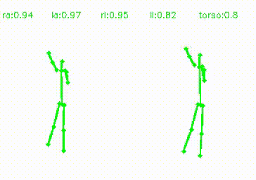
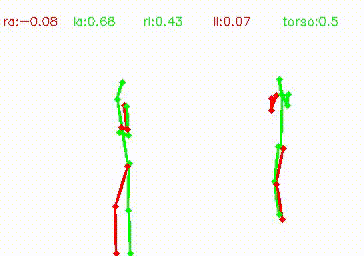
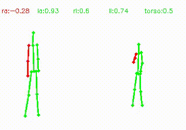
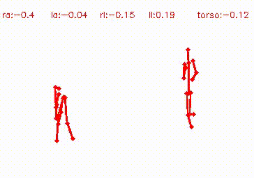
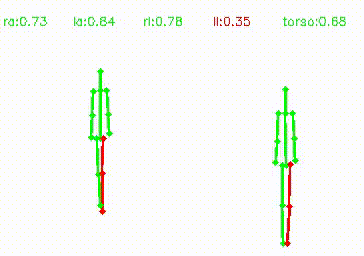

# A Body Part Embedding Model with Datasets for Measuring 2D Human Motion Similarity

PyTorch implementation of [A Body Part Embedding Model with Datasets for Measuring 2D Human Motion Similarity](https://ieeexplore.ieee.org/document/9366759), IEEE Access.

We propose a learning framework with datasets to generate embeddings for measuring motion similarity for each human body part. See [project page](https://chico2121.github.io/bpe/) for the details.

|   |   |   |   |   |   |
|---|---|---|---|---|---|

## Getting Started

### Installation

- Clone this repo

  ```bash
  git clone https://github.com/chico2121/bpe.git
  cd bpe
  ```

- Install dependencies

  ```bash
  pip install -r requirements.txt
  ```
  
- Working directory is assumed to be bpe (or bpe-master). Make sure to export PYTHONPATH:

  ```bash
  export PYTHONPATH=$PYTHONPATH:/absolute-path-to/[bpe or bpe-master]
  ```

### Data preparation

- Download and place SARA dataset in `bpe-datasets`. Please follow the instructions to [download and prepare](https://github.com/chico2121/SARA_Dataset) the dataset. 

- [Download](https://github.com/SukhyunCho/NTU_motion_sim_annotations) and place NTU motion similarity annotations in `bpe-datasets`.

### Trainining

- Train the model on GPU:

  ```
  python train_bpe.py
    -g 0
    --data_dir <path_to>/SARA_released
    --use_footvel_loss
    --logdir <path_to_dir>
  ```

  Execute `python train_bpe.py --help` for parameters description:

  `-data_dir` : Path to the data

  `—use_footvel_loss`: To use foot velocity loss.

  `-logdir`: Path to logdir where tensorboard visualization and model parameters are saved

### Inference

- Measuring correlation score between predicted similarity and AMT annotations of NTU:

  ```
  python python bin/ntu_similarity.py
    --data_dir <path to>/SARA_released
    --model_path <path to directory with model checkpoints (e.g. exp-bpe/model/*.pth) >
    --ntu_dir <path to pose data of ntu (i.e. NTU_motion_sim_annotations/refined_skeleton) >
  ```

  Execute `python bin/ntu_similarity.py --help` for more options.

- Inference code producing video output for motion similarity for a pair of videos:

  ```
  python python bin/inference_single_pair_visuals.py
    --data_dir <path to data dir>
    --model_path <path to model checkpoint>
    --video1 <path to video1's pose sequence>
    --video2 <path to video2's pose sequence>
    -h1 <video1's height>
    -h2 <video2's height>
    -w1 <video1's width>
    -w2 <video2's width>
    --use_flipped_motion
    --video_sampling_window_size <number of frames>
    --video_sampling_stride <stride in number of frames>
    --similarity_measurement_window_size <number of oversampled video sequences>
    --out_filename <filename>.mp4
    --thresh 0.4
  ```

  Execute `python bin/inference_single_pair_visuals.py --help` for parameters description:

  `--data_dir` : Path to the data (include meanpose, stdpose npy files)

  `--model_path` : Path to the model checkpoint

  `-video1`, `-video2` : JSON path of the pose sequences of video 1 and video 2

  `-h1`, `-h2` : Image height of video 1 and video 2

  `-w1`, `-w2` : Image width of video 1 and video 2

  `-use_flipped_motion`: Using flipped body skeleton when measuring similarity

  `--video_sampling_window_size` : parameter for sliding window sampling

  `--video_sampling_stride` : stride of sliding window

  `--similarity_measurement_window_size` : number of sampled sequences used for similarity score averaging

  `--out_filename` : path and name of the output video file

  `--thresh` : threshold to visualize body parts where similarity score is above or below the `thresh`([-1, 1])


## Citation
If you use this code for your research, please cite the paper:
```
@ARTICLE{9366759,
  author={J. {Park} and S. {Cho} and D. {Kim} and O. {Bailo} and H. {Park} and S. {Hong} and J. {Park}},
  journal={IEEE Access}, 
  title={A Body Part Embedding Model With Datasets for Measuring 2D Human Motion Similarity}, 
  year={2021},
  volume={9},
  number={},
  pages={36547-36558},
  doi={10.1109/ACCESS.2021.3063302}}
```

## Acknowledgments
This code borrows heavily from [2D-Motion-Retargeting](https://github.com/ChrisWu1997/2D-Motion-Retargeting).
